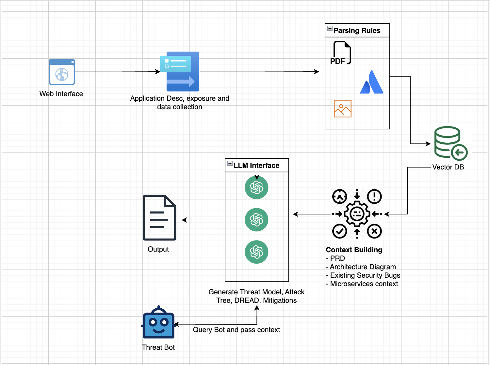

# ThreatShield 🛡️

[](https://opensource.org/licenses/MIT)
[](https://github.com/threatshield/threatshield)

ThreatShield is a comprehensive AI-powered threat modeling platform designed to assist security engineers in identifying, analyzing, and mitigating potential security threats. Leveraging OpenAI's advanced language models, ThreatShield transforms security assessment workflows with intelligent automation and insightful visualizations.

<div align="center">
  
</div>

If you find ThreatShield useful, please consider starring the repository on GitHub. This helps more people discover the tool. Your support is greatly appreciated! ⭐

## ✨ Key Features

### 🔍 Document Intelligence
- **RAG-powered Analysis**: Process and analyze technical documentation, architecture diagrams, and security requirements
- **Confluence Integration**: Direct import from Confluence spaces for seamless workflow
- **PDF Processing**: Extract and analyze content from PDF documents
- **Image Analysis**: Extract architecture information from diagrams and flowcharts

### 🔒 Security Assessment
- **AI-driven Threat Modeling**: Generate comprehensive threat models based on application details
- **DREAD Risk Assessment**: Quantify risks using the DREAD methodology (Damage, Reproducibility, Exploitability, Affected users, Discoverability)
- **Attack Tree Visualization**: Interactive attack trees to visualize potential attack paths
- **Mitigation Strategies**: AI-generated recommendations for addressing identified threats
- **Security Test Cases**: Automated generation of security test cases to verify mitigations

### 💬 Interactive Experience
- **Natural Language Chat**: Interact with your security data using natural language queries
- **Custom Prompting**: Tailor the analysis with custom security requirements
- **Report History**: Access and manage previous security assessments
- **Analytics Dashboard**: Visualize security metrics and insights

## 🚀 Getting Started

### Prerequisites
- Python 3.8+
- Node.js 14+ (for the frontend)
- OpenAI API key

### Setup Instructions

1. **Clone the Repository**: 
   ```bash
   git clone https://github.com/threatshield/threatshield.git
   cd ThreatShield
   ```

2. **Install Backend Dependencies**:
   ```bash
   pip install -r requirements.txt
   ```

3. **Configure Environment Variables**:
   Create a `.env` file in the root directory with the following variables:

   **API Keys and Authentication**
   ```
   OPENAI_API_KEY=your_openai_api_key
   CONFLUENCE_API_KEY=your_confluence_api_key
   CONFLUENCE_USERNAME=your_confluence_username
   SLACK_API_TOKEN=your_slack_bot_token
   ```

   **LLM Provider Configuration**
   ```
   LLM_METHOD=OPENAI  # Change to BEDROCK when using Bedrock**
   ```

   **Bedrock Configuration (required when LLM_METHOD=BEDROCK)**
   ```
   BEDROCK_BASE_URL=your_bedrock_api_url
   BEDROCK_API_KEY=your_bedrock_api_key
   BEDROCK_MODEL=your_bedrock_model_name
   ```

4. **Start the Backend Server**:
   ```bash
   python app.py
   ```

5. **Install and Run Frontend** (optional, for development):
   ```bash
   cd threat-shield
   npm install
   npm start
   ```
 **Note**: ThreatShield requires the following OpenAI models to be enabled:
   - **gpt-4o**: for threat modeling and analysis (any other reasoning model can also be used)
   - **text-embedding-3-large**: for vector database creation

## 🔧 Technical Architecture

ThreatShield combines a Flask backend with a React frontend to deliver a seamless security assessment experience:

- **Backend**: Python/Flask API server with OpenAI integration
- **Frontend**: React with TypeScript and Tailwind CSS
- **Document Processing**: PDF mining and RAG (Retrieval Augmented Generation)
- **Storage**: File-based storage system for assessment data

## 📁 Project Structure

- `app.py`: Main application file that sets up the Flask server and routes
- `llm/openai_module.py`: OpenAI API integration for AI capabilities
- `rag/rag_handler.py`: Document processing and RAG implementation
- `core/`: Core modules for security assessment functionality
  - `threat_modeling.py`: Threat model generation
  - `dread.py`: DREAD risk assessment
  - `mitigation.py`: Mitigation strategy generation
  - `attack_tree.py`: Attack tree visualization
  - `chat.py`: Natural language interaction
- `utils/`: Utility modules for configuration and document handling
- `threat-shield/`: React frontend application

## 🔌 API Endpoints

### Document Processing
- `POST /api/upload`: Upload documents and images for processing

### Security Assessment
- `GET /api/threat-model`: Generate a threat model
- `GET /api/dread-assessment`: Generate a DREAD assessment
- `GET /api/attack-tree`: Generate an attack tree
- `GET /api/mitigations`: Generate mitigation strategies

### Interaction
- `POST /api/query-ai`: Query the AI with natural language
- `GET /api/storage`: Access stored assessment data

## 🤝 Contributing

Contributions are welcome! Please feel free to submit a Pull Request.

1. Fork the repository
2. Create your feature branch (`git checkout -b feature/amazing-feature`)
3. Commit your changes (`git commit -m 'Add some amazing feature'`)
4. Push to the branch (`git push origin feature/amazing-feature`)
5. Open a Pull Request

## 📄 License

This project is licensed under the MIT License - see the LICENSE file for details.
