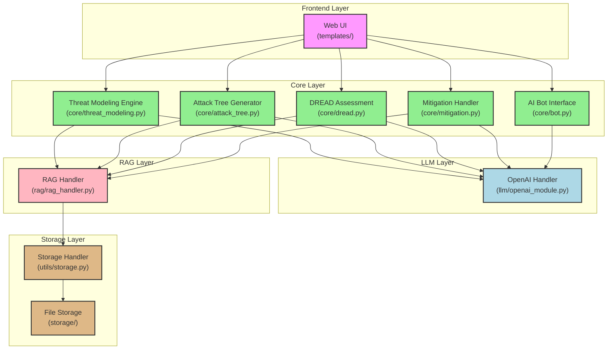
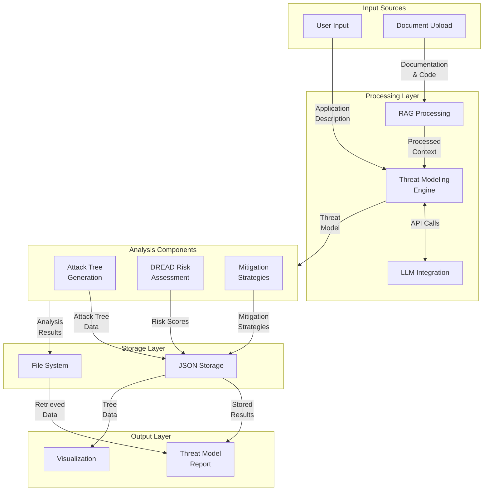

# Threat Modeling Application Architecture

## High-Level Architecture Diagram



## Data Flow Diagram



## Component Interaction Diagram

```mermaid
sequenceDiagram
    participant U as User
    participant W as Web UI
    participant T as Threat Model Engine
    participant L as LLM Service
    participant R as RAG Handler
    participant S as Storage

    U->>W: Submit Application Details
    W->>T: Process Request
    T->>R: Get Context
    R->>S: Retrieve Related Data
    S-->>R: Return Context
    R-->>T: Provide Context
    T->>L: Generate Threat Model
    L-->>T: Return Analysis
    T->>S: Store Results
    T-->>W: Return Response
    W-->>U: Display Results

    Note over U,S: Subsequent Analysis Flow
    U->>W: Request Additional Analysis
    W->>T: Process Analysis Request
    T->>S: Get Threat Model
    S-->>T: Return Model
    T->>L: Generate Analysis<br/>(Attack Tree/DREAD/Mitigation)
    L-->>T: Return Analysis
    T->>S: Store Analysis
    T-->>W: Return Results
    W-->>U: Display Analysis
